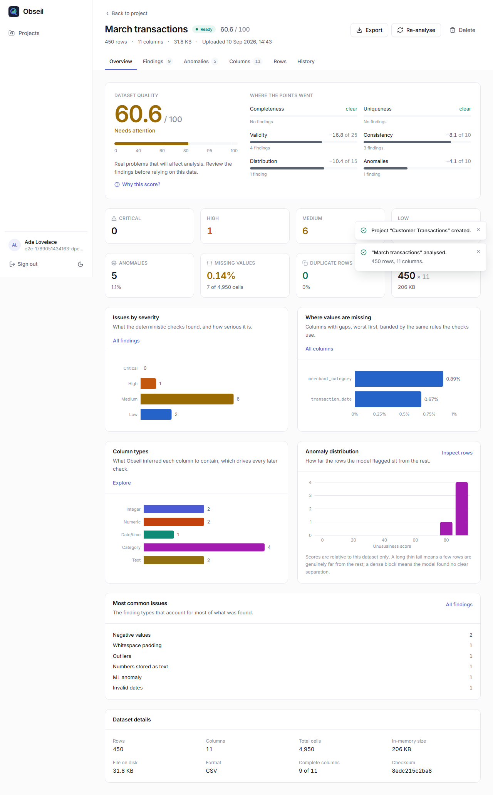
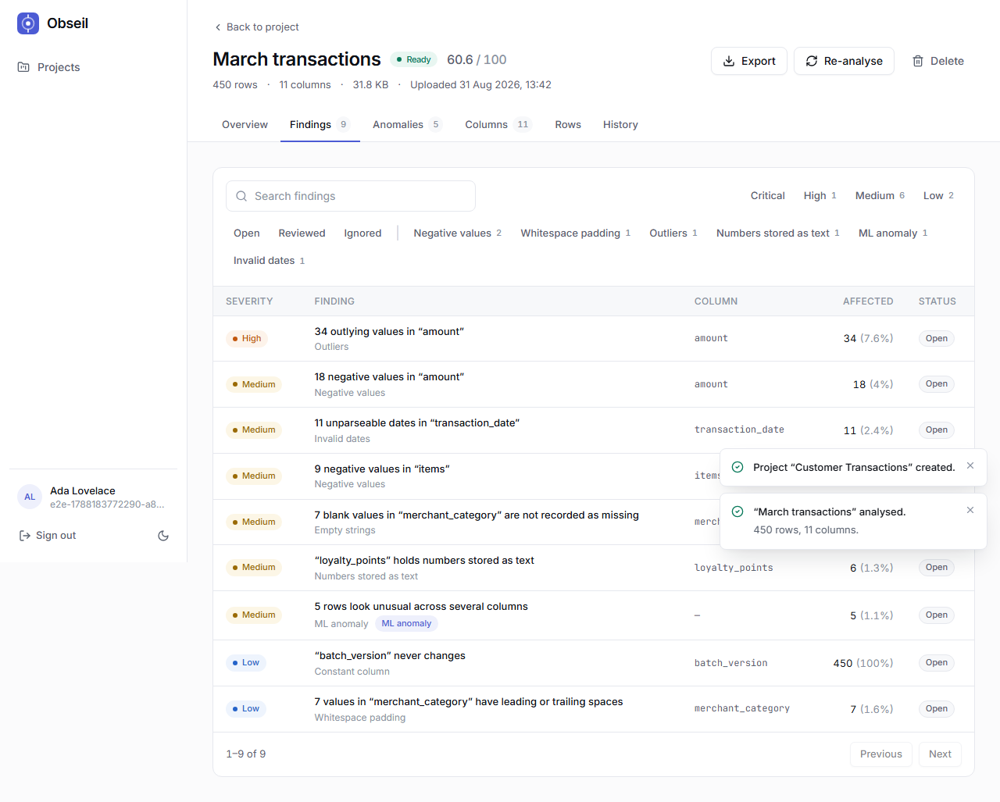
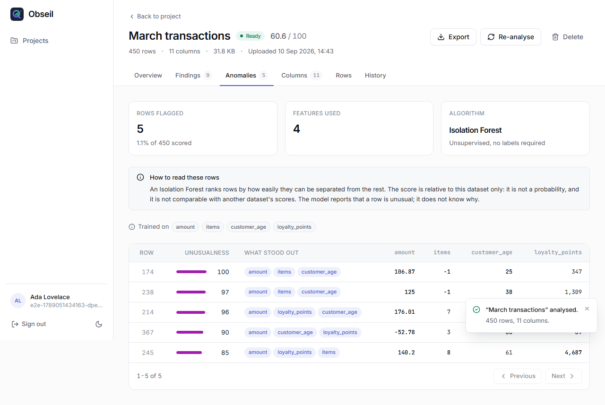
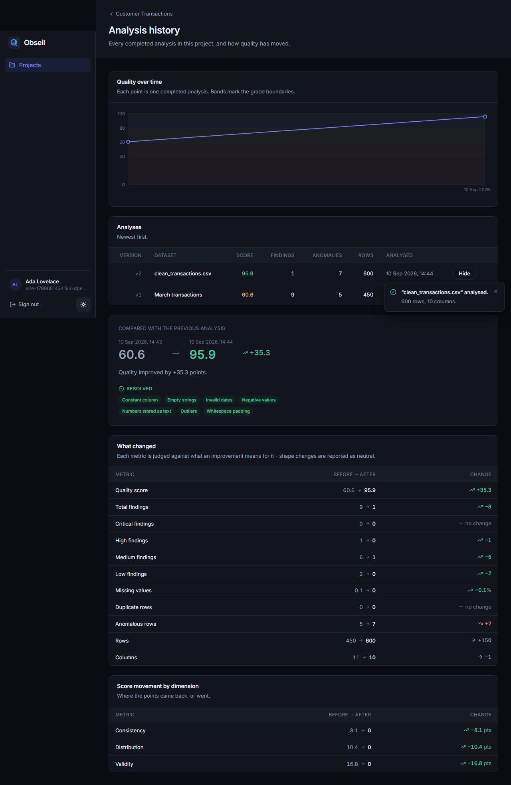

<div align="center">

# Obseil

**Uncover what's hidden in your data.**

AI-powered data quality intelligence for modern teams.

[](https://github.com/Obseil/Obseil/actions/workflows/ci.yml)
[](LICENSE)
[](https://www.python.org/)
[](https://www.typescriptlang.org/)

</div>

---

## What is Obseil?

Upload a CSV or XLSX file and Obseil answers one question:

> **Can I trust this dataset?**

It profiles the data, runs a suite of deterministic quality detectors, runs an
unsupervised anomaly model over the numeric feature space, turns everything it
finds into individually reviewable **findings**, and rolls those findings up
into an explainable **0-100 quality score**.

Every number it shows you can be traced back to the rule or the statistic that
produced it. Obseil never says "the model thinks this is wrong" without also
saying which columns pushed the row away from the rest - and it never claims to
know *why*.



<table>
<tr>
<td width="50%"></td>
<td width="50%"></td>
</tr>
<tr>
<td colspan="2"></td>
</tr>
</table>

<sub>Screenshots are generated from the running application by
`e2e/tests/screenshots.spec.ts`, so they cannot drift from what the product
actually renders.</sub>

## Features

**Profiling.** Row and column counts, memory footprint, a per-column semantic
type (integer, numeric, date/time, boolean, category, text) inferred
independently of the pandas dtype, and statistics that are only computed where
they mean something - quartiles for numerics, cardinality for categories,
length and whitespace for text.

**Quality detection.** Thirteen deterministic checks across five dimensions,
each one a named rule with a documented threshold:

| Dimension | Checks |
| --- | --- |
| Completeness | missing values, empty columns, incomplete rows |
| Uniqueness | duplicate rows, duplicate identifiers |
| Validity | invalid dates, negative values, numbers stored as text |
| Consistency | empty strings, whitespace padding, constant columns |
| Distribution | outliers (IQR with skew correction), high cardinality |

**Anomaly detection.** An Isolation Forest over the numeric feature space finds
rows that are unusual *in combination* - a plausible amount and a plausible item
count that never occur together. This is the one place a model earns its keep,
because no single-column rule can see joint structure.

**Explainable scoring.** A 0-100 score built from a published penalty formula,
returned with its full derivation: which findings cost how much, capped per
dimension. The UI shows the same arithmetic the API returns.

**Sign-in.** Email and password, or **Continue with Google / GitHub** when the
deployment configures them - authorization code flow with PKCE, run server-side,
with account linking allowed only on a provider-verified email address.

**Triage.** Every finding can be marked reviewed, resolved or dismissed, with a
note. Feedback is recorded against the finding, so a false positive can be
suppressed without pretending it was never detected.

**History and comparison.** Every analysis is retained. Two runs can be
compared field by field - score movement, findings resolved and introduced, and
which dimensions the points came back from.

**Reports.** PDF (ReportLab, no headless browser) and CSV export of an
analysis, including the score derivation and the findings list.

## Status

All ten delivery phases are complete. See
[`docs/IMPLEMENTATION_PLAN.md`](docs/IMPLEMENTATION_PLAN.md) for the
architecture and the phase-by-phase plan.

| Phase | Scope | Status |
| ----- | ----- | ------ |
| 1 | Repository, backend & frontend skeleton, Docker, CI | ✅ |
| 2 | Authentication, projects | ✅ |
| 3 | Dataset upload, profiling engine | ✅ |
| 4 | Quality detection engine | ✅ |
| 5 | Isolation Forest anomaly detection, quality score | ✅ |
| 6 | Dashboard, findings, dataset explorer | ✅ |
| 7 | Analysis history and comparison | ✅ |
| 8 | Report export (PDF / CSV) | ✅ |
| 9 | Testing expansion, E2E, security & performance review | ✅ |
| 10 | UI/UX polish, documentation, open-source setup | ✅ |

This is an MVP, and the [known gaps](docs/SECURITY_REVIEW.md#known-gaps) are
written down rather than glossed over.

## Architecture

```
┌─────────────────────────────────────────────────────────┐
│  React SPA - TanStack Query owns all server state       │
└───────────────────────────┬─────────────────────────────┘
                            │  JSON over HTTP, bearer tokens
┌───────────────────────────▼─────────────────────────────┐
│  FastAPI routes - thin: validate, authorize, delegate    │
├─────────────────────────────────────────────────────────┤
│  Services - business logic, transactions, ownership      │
├──────────┬──────────┬──────────┬──────────┬─────────────┤
│ profiling│ quality  │    ml    │ reports  │   storage   │
│  pandas  │detectors │ sklearn  │ReportLab │  pluggable  │
├──────────┴──────────┴──────────┴──────────┴─────────────┤
│  SQLAlchemy models  →  PostgreSQL                        │
└─────────────────────────────────────────────────────────┘
```

Four decisions worth knowing about:

- **Routes hold no business logic.** They validate input, resolve the current
  user, and call a service. Every ownership check goes through one of three
  choke points (`get_owned_project`, `get_owned_dataset`, `get_owned_analysis`),
  each of which returns **404, not 403**, so an id you don't own tells you
  nothing.
- **The analysis pipeline is synchronous.** Handlers are plain `def`, so
  FastAPI runs them in a threadpool - correct for CPU-bound pandas work, and it
  avoids blocking the event loop. There is no queue because the MVP does not
  need one; the split between "store the file" and "analyse it" already exists
  in the service layer, so adding one later is a change of caller, not design.
- **Detectors are plugins.** A quality detector implements one ABC and registers
  itself. The engine is fail-soft: a detector that raises is logged and skipped,
  and the rest of the analysis still completes.
- **Storage is an interface.** `StorageBackend` has one local implementation;
  keys are generated server-side, never taken from the upload's filename.

## Tech stack

| Layer | Choice |
| ----- | ------ |
| Frontend | React 18, TypeScript (strict), Vite 6, Tailwind CSS v4, Recharts, React Router, TanStack Query |
| Backend | Python 3.11+, FastAPI, Pydantic v2, SQLAlchemy 2.0, Alembic |
| Auth | bcrypt, PyJWT, OAuth 2.0 + PKCE (Google, GitHub) |
| Data / ML | pandas, NumPy, scikit-learn (Isolation Forest) |
| Database | PostgreSQL 16 |
| Reports | ReportLab (PDF) |
| Testing | pytest, Vitest, React Testing Library, Playwright |
| Tooling | Ruff, Black, mypy, ESLint, Prettier, Docker, GitHub Actions |

## Methodology

The full write-up is [`docs/METHODOLOGY.md`](docs/METHODOLOGY.md). The short
version:

### Rules versus machine learning

The dividing line is deliberate and documented.
[A rule is used wherever a rule is correct](docs/METHODOLOGY.md#1-rules-versus-machine-learning) -
a null is a null, a duplicate is a duplicate, and dressing that up as ML would
be worse in every way: slower, less accurate, and unexplainable. The model is
reserved for the one question rules cannot answer, which is whether a row is
unusual *given the joint distribution of every numeric column at once*.

### Anomaly detection

Isolation Forest, because it isolates rare points directly rather than modelling
density, needs no labels, and scales linearly.
[Features are not scaled](docs/METHODOLOGY.md#feature-preparation), because the
algorithm's axis-aligned splits are invariant to per-feature rescaling -
scaling would be cargo-culting.

The threshold is the interesting part. scikit-learn's `contamination="auto"`
flagged **49% of a known-clean dataset**, which is useless. Obseil instead uses
the forest for *ranking* and derives the cut-off from the score distribution
with the [Iglewicz-Hoaglin modified z-score](docs/METHODOLOGY.md#where-the-threshold-comes-from)
(cut-off 3.5, MAD-based, mean-absolute-deviation fallback), plus a hard 2%
ceiling. On the purpose-built fixture this finds 12 of 12 planted anomalies and
zero on the clean file.

Obseil reports which columns deviated most from their column's centre for a
flagged row. **It never claims to know the cause.**

### Quality score

`score = 100 − Σ penalties`, where each finding's penalty is a severity weight
(critical 30, high 18, medium 8, low 2) times a coverage multiplier (0.5×-1.5×,
by how much of the dataset it touches), and each dimension's total is capped.
The caps sum to 120, so no single dimension can zero the score alone. The API
returns the derivation, not just the number.

## API

Interactive docs are served at `/docs` (Swagger) and `/redoc` - both are
disabled when `OBSEIL_ENV=production`.

| Method | Path | Purpose |
| --- | --- | --- |
| `POST` | `/api/v1/auth/register` · `/login` · `/refresh` · `/logout` | Session lifecycle |
| `GET` | `/api/v1/auth/me` | Current user |
| `GET` `POST` | `/api/v1/projects` | List and create projects |
| `GET` `PATCH` `DELETE` | `/api/v1/projects/{id}` | Read, rename, delete |
| `GET` `POST` | `/api/v1/projects/{id}/datasets` | List datasets, upload and analyse |
| `GET` `DELETE` | `/api/v1/datasets/{id}` | Dataset detail |
| `POST` | `/api/v1/datasets/{id}/analyze` | Re-run the analysis |
| `GET` | `/api/v1/datasets/{id}/statistics` | Full profile of the latest analysis |
| `GET` | `/api/v1/datasets/{id}/preview` | Paginated rows |
| `GET` | `/api/v1/datasets/{id}/findings` · `/findings/summary` | Findings and roll-ups |
| `PATCH` | `/api/v1/findings/{id}` | Triage a finding |
| `GET` | `/api/v1/datasets/{id}/anomalies` · `/anomalies/overview` | Flagged rows and model metadata |
| `GET` | `/api/v1/datasets/{id}/score` | Score with its derivation |
| `GET` | `/api/v1/datasets/{id}/history` · `/projects/{id}/history` · `/history/trend` | Past analyses |
| `GET` | `/api/v1/analyses/{id}/compare` | Compare two analyses |
| `POST` | `/api/v1/reports/{analysis_id}/export` | PDF or CSV report |
| `GET` | `/api/v1/reports/formats` | Available export formats |
| `GET` | `/api/v1/health` · `/health/ready` | Liveness and readiness |

Every error uses one envelope:

```json
{ "error": { "code": "not_found", "message": "…", "request_id": "…", "details": {} } }
```

## Quick start

### With Docker

```bash
git clone https://github.com/Obseil/Obseil.git
cd Obseil
cp .env.example .env          # then edit OBSEIL_SECRET_KEY
docker compose up --build
```

| Service | URL |
| ------- | --- |
| Web | http://localhost:3000 |
| API | http://localhost:8000 |
| API docs | http://localhost:8000/docs |

The API container runs `alembic upgrade head` on start, so the schema is
created for you. All three services declare healthchecks, and `db` gates `api`
via `depends_on: service_healthy`.

This path is verified end to end: both images build, all three containers
report healthy from an empty volume, and the sample datasets score identically
against PostgreSQL to the way they score on SQLite.

### Without Docker

**Backend**

```bash
cd backend
python -m venv .venv
source .venv/bin/activate          # Windows: .venv\Scripts\activate
pip install -r requirements-dev.txt
alembic upgrade head
uvicorn app.main:app --reload
```

**Frontend**

```bash
cd frontend
npm install
npm run dev
```

A local PostgreSQL instance is required; the connection string comes from
`OBSEIL_DATABASE_URL`. Start one quickly with `docker compose up db`.

Then upload one of the [sample datasets](data/samples/) - `invalid_values.csv`
produces a rich set of findings, `clean_transactions.csv` should produce almost
none.

## Environment variables

Every setting is documented in [`.env.example`](.env.example). Nothing is
hardcoded, and the application **refuses to boot** in `production` with a
default `OBSEIL_SECRET_KEY` or with `DEBUG` enabled.

The ones worth knowing:

| Variable | Default | Effect |
| --- | --- | --- |
| `OBSEIL_SECRET_KEY` | *(dev placeholder)* | JWT signing key; must be changed |
| `OBSEIL_DATABASE_URL` | local PostgreSQL | SQLAlchemy URL |
| `OBSEIL_MAX_UPLOAD_BYTES` | 50 MiB | Upload size ceiling |
| `OBSEIL_PROFILE_SAMPLE_ROWS` | 50,000 | Above this, analysis runs on a head sample (always disclosed in the UI) |
| `OBSEIL_MAX_ANALYSIS_ROWS` | 1,000,000 | Above this, the file is refused outright |
| `OBSEIL_ANOMALY_CONTAMINATION` | `auto` | Overrides the derived threshold |
| `OBSEIL_LOGIN_MAX_ATTEMPTS` | 10 | Failed logins per client address before a 429; raise it if your users share one outbound address |
| `OBSEIL_PASSWORD_HASH_ROUNDS` | 12 | bcrypt work factor; production refuses anything lower |
| `OBSEIL_OAUTH_GOOGLE_CLIENT_ID` / `_SECRET` | *(empty)* | Enables "Continue with Google"; blank means the button is not shown |
| `OBSEIL_OAUTH_GITHUB_CLIENT_ID` / `_SECRET` | *(empty)* | Enables "Continue with GitHub" |
| `OBSEIL_API_BASE_URL` | `http://localhost:8000` | Public API origin, used to build the provider callback URL |
| `OBSEIL_FRONTEND_BASE_URL` | `http://localhost:5173` | Where the browser is sent after a provider sign-in |

Generate a secret with:

```bash
python -c "import secrets; print(secrets.token_urlsafe(48))"
```

### Enabling Google or GitHub sign-in

Both are optional and off by default. Register an application with the
provider, set the callback URL it asks for to
`<OBSEIL_API_BASE_URL>/api/v1/auth/oauth/<provider>/callback`, and put the
client id and secret in your `.env`:

| Provider | Where | Callback URL to register |
| --- | --- | --- |
| Google | Cloud Console -> APIs & Services -> Credentials -> OAuth client ID (Web application) | `http://localhost:8000/api/v1/auth/oauth/google/callback` |
| GitHub | Settings -> Developer settings -> OAuth Apps -> New OAuth App | `http://localhost:8000/api/v1/auth/oauth/github/callback` |

The buttons appear on the sign-in and registration pages as soon as
credentials are present, and disappear again when they are not.

## Testing

**645 tests**: 507 backend, 126 frontend, 12 end-to-end scenarios (the journey
runs at both desktop and phone widths).

```bash
# Backend - unit + API tests, no services required
cd backend && pytest

# Backend - lint, format and types
ruff check . && black --check . && mypy app

# Frontend - unit and component tests
cd frontend && npm test

# Frontend - lint, format and types
npm run lint && npm run format:check && npm run typecheck

# End-to-end - Playwright starts both servers itself
cd e2e && npm install && npm run install:browsers && npm test
```

Two things the test suite does that are worth calling out:

- **Six purpose-built fixtures** in [`data/samples/`](data/samples/) with known
  defects. `clean_transactions.csv` producing **zero** rule findings is an
  assertion, not an aspiration - it is how false positives get caught.
- **A 22-endpoint authorization matrix** in
  `backend/tests/api/test_security.py`. One list drives three checks, and one
  of them walks the router itself, so adding a scoped route without covering it
  fails the build rather than passing quietly.

The E2E suite found two real bugs the unit tests could not - see
[`e2e/README.md`](e2e/README.md).

## Continuous integration

[`.github/workflows/ci.yml`](.github/workflows/ci.yml) runs five jobs on every
push and pull request:

| Job | What it proves |
| --- | --- |
| `backend` | Ruff, Black, mypy and pytest with coverage |
| `frontend` | ESLint, Prettier, `tsc`, Vitest and a production build |
| `migrations` | Migrations apply, roll all the way back, re-apply, and **match the models** (`alembic check`) against real PostgreSQL |
| `e2e` | Playwright against a real API and the production bundle |
| `docker` | Both images build |

## Documentation

| Document | Contents |
| --- | --- |
| [`docs/METHODOLOGY.md`](docs/METHODOLOGY.md) | Every rule, threshold and statistic, with its reasoning |
| [`docs/SECURITY_REVIEW.md`](docs/SECURITY_REVIEW.md) | Threat model, controls, and known gaps |
| [`docs/PERFORMANCE.md`](docs/PERFORMANCE.md) | Measured timings, two fixed inefficiencies, and a measurement trap |
| [`docs/IMPLEMENTATION_PLAN.md`](docs/IMPLEMENTATION_PLAN.md) | Architecture and the delivery plan |
| [`e2e/README.md`](e2e/README.md) | How the end-to-end suite works |
| [`data/samples/README.md`](data/samples/README.md) | What each fixture contains and what should be found in it |

## Repository layout

```
.
├── backend/            FastAPI service
│   ├── app/
│   │   ├── api/        HTTP routes (thin - no business logic)
│   │   ├── core/       config, logging, errors, security
│   │   ├── db/         engine, session, declarative base
│   │   ├── models/     SQLAlchemy models
│   │   ├── schemas/    Pydantic request/response contracts
│   │   ├── services/   business logic
│   │   ├── profiling/  dataset profiling engine
│   │   ├── quality/    deterministic quality detectors
│   │   ├── ml/         anomaly detection
│   │   ├── reports/    PDF / CSV export
│   │   └── storage/    pluggable file storage
│   ├── alembic/        migrations
│   ├── scripts/        benchmark harness
│   └── tests/
├── frontend/           React client
│   └── src/{components,pages,layouts,hooks,services,types,utils}
├── data/samples/       purpose-built test datasets
├── docs/               methodology, security, performance
├── e2e/                Playwright end-to-end tests
└── docker-compose.yml
```

## Deployment

Both images are production-shaped already: the API runs as a non-root user
behind uvicorn, and the frontend is a static bundle served by nginx. To deploy:

1. Set `OBSEIL_ENV=production`, `OBSEIL_DEBUG=false` and a real
   `OBSEIL_SECRET_KEY` - the app will refuse to start otherwise.
2. Point `OBSEIL_DATABASE_URL` at a managed PostgreSQL instance and run
   `alembic upgrade head` as a release step.
3. Set `OBSEIL_CORS_ORIGINS` to the web origin, and terminate TLS at the proxy.
4. Mount durable storage at `OBSEIL_STORAGE_PATH`, or implement the S3
   `StorageBackend` (see below).

The security posture, including what is **not** yet handled, is written up in
[`docs/SECURITY_REVIEW.md`](docs/SECURITY_REVIEW.md).

## Future improvements

Deliberately out of scope for the MVP, and none of them require a rewrite:

- **S3-compatible storage** - `StorageBackend` is already the seam.
- **Background analysis** - move `analyze_dataset` behind a queue when files get
  big enough that an inline request is the wrong shape.
- **More detectors** - referential integrity across datasets, regex/format
  validation, cross-column consistency rules.
- **Learned severity** - feed triage feedback back into severity ranking, once
  there is enough of it to be more than a guess.
- **Scheduled monitoring** - re-analyse a source on a schedule and alert on
  score regressions; the history and comparison machinery already exists.
- **Team accounts** - projects are single-owner today.

## Contributing

Obseil is built to be extended - new quality detectors, new anomaly detectors,
new file formats, new report formats. [CONTRIBUTING.md](CONTRIBUTING.md) has the
setup, the conventions, a walkthrough of **adding a detector**, and a list of
good first issues.

Please also read the [Code of Conduct](CODE_OF_CONDUCT.md) and, for anything
security-related, [SECURITY.md](SECURITY.md).

## License

[MIT](LICENSE)
